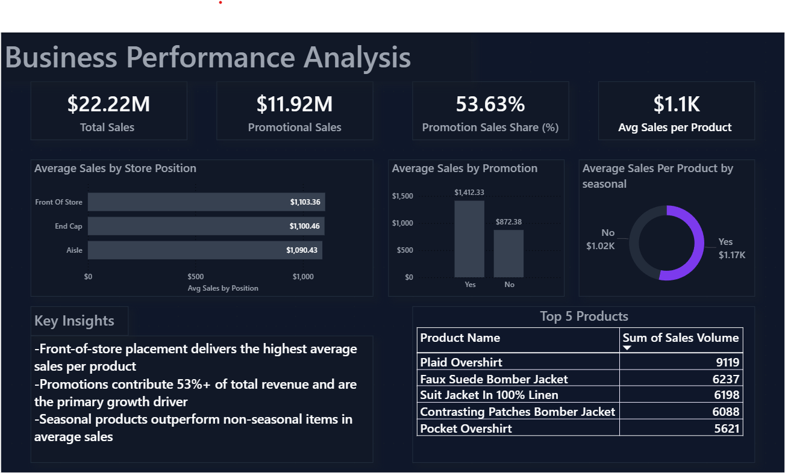

# Business Performance & KPI Dashboard

## Overview
This project presents an end-to-end retail sales performance analysis focused on identifying key revenue drivers such as promotions, store placement, and seasonality. The analysis is delivered through a clean, decision-ready Power BI dashboard.

## Objectives
- Analyze overall sales performance using KPIs  
- Measure the impact of promotions on revenue  
- Evaluate sales performance by store position  
- Compare seasonal vs non-seasonal product performance  
- Identify top-performing products  

## Tools & Technologies
- Excel – Initial data inspection  
- SQL (MySQL) – KPI calculations and analysis  
- Power BI – Data cleaning, DAX measures, and dashboard design  

## Key Insights
- Front-of-store placement generates the highest average sales per product  
- Promotions contribute over **50% of total sales**, making them the primary revenue driver  
- Seasonal products outperform non-seasonal products in average sales  

## Dashboard Preview

## Outcome
This project demonstrates an end-to-end analytics workflow suitable for data analyst internships and entry-level roles.
